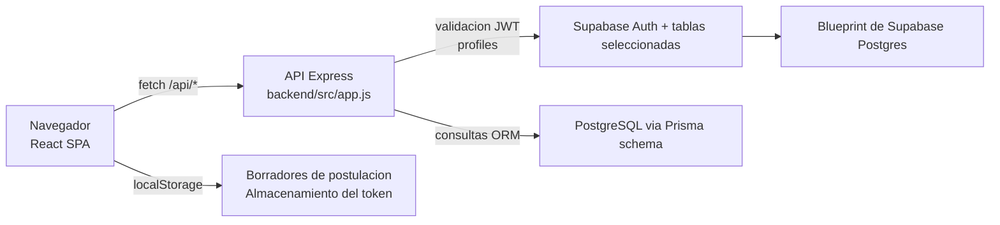

# Arquitectura de NIDO

Ultima actualizacion: 2026-04-27

## Resumen ejecutivo

NIDO funciona hoy como una SPA en el navegador que se comunica con una unica API en Express. La API delega la autenticacion y la lectura de perfiles a Supabase, pero las operaciones de propiedades, favoritos y solicitudes de arriendo se implementan con Prisma sobre un esquema relacional separado definido en `backend/prisma/schema.prisma`.

Esto crea una arquitectura hibrida:

- autenticacion y perfiles: Supabase
- catalogo de propiedades y solicitudes de arriendo: Prisma/Postgres
- precalificacion de postulaciones: Supabase
- estado del borrador de postulacion y progreso del checklist documental: localStorage

Esa separacion es el dato arquitectonico mas importante para cualquier mantenedor.

## Topologia en ejecucion

## Arquitectura del frontend

### Composicion

- `frontend/src/main.jsx` inicia la app con `BrowserRouter`.
- `frontend/src/App.jsx` declara todas las rutas publicas y protegidas.
- `frontend/src/app/providers/AuthProvider.jsx` administra el estado de autenticacion.
- `frontend/src/lib/apiClient.js` envuelve `fetch`, inyecta el bearer token desde localStorage y normaliza errores de API.

### Mapa de rutas

- `/`: home y propiedades destacadas
- `/properties`: catalogo buscable
- `/properties/:id`: detalle de propiedad
- `/properties/:id/apply/start`
- `/properties/:id/apply/prequal`
- `/properties/:id/apply/documents`
- `/properties/:id/apply/review`
- `/login`
- `/register`
- `/saved`
- `/account`
- `/manage`

### Modelo de estado del frontend

- el estado de autenticacion vive en React context
- el estado de ruta se usa para transportar la intencion posterior al login
- el estado de busqueda se refleja en los query params de la URL
- el estado del flujo de postulacion se guarda en localStorage con `nido_application_draft_<propertyId>`

## Arquitectura del backend

### Composicion

- `backend/src/server.js`: inicia el servidor HTTP
- `backend/src/app.js`: configura CORS, parsers, `/health`, `/api` y el manejo de errores
- `backend/src/routes.js`: monta los routers de dominio

### Modulos de rutas activos

- `auth`
- `properties`
- `applications`
- `requests`
- `users`
- `favorites`

Nota:

- `requests` ya existia en el codebase, pero no estaba montado antes de esta iteracion de documentacion. Ahora si esta montado en `backend/src/routes.js`.

### Bloques compartidos del backend

- `shared/env.js`: carga el `.env` raiz
- `shared/supabase.js`: clientes Supabase y helpers de perfiles
- `shared/supabase-auth.js`: wrappers de servicio para register/login/reset-password
- `shared/supabase-auth-middleware.js`: middleware de autenticacion requerida y por rol
- `shared/prisma.js`: singleton de Prisma
- `shared/validate.js`: middleware de validacion con Joi
- `shared/errors.js` y `shared/errorHandler.js`: normalizacion de errores
- `shared/serializers.js`: formateo de respuestas API para usuarios, propiedades y solicitudes de arriendo

## Arquitectura de persistencia

## 1. Esquema Prisma en ejecucion

Definido en `backend/prisma/schema.prisma`.

Usado directamente por:

- `properties`
- `favorites`
- `requests`

Modelos principales:

- `User`
- `Property`
- `PropertyImage`
- `Favorite`
- `RentalRequest`

## 2. Tablas Supabase en ejecucion usadas por el codigo

Referenciadas directamente por:

- `shared/supabase.js`
- `shared/supabase-auth.js`
- `modules/users/user.controller.js`
- `modules/applications/application.controller.js`

Tablas tocadas activamente por el codigo actual:

- `profiles`
- `landlords`
- `tenants`
- `properties`
- `property_images`
- `applications`

## 3. Blueprint de flujo en Supabase

La migracion tambien define tablas y triggers de un ciclo de vida mas amplio:

- `prequalification_results`
- `document_requirements`
- `document_uploads`
- `verifications`
- `approval_decisions`
- `contracts`
- `contract_parties`
- `signatures`
- `payments`
- `payout_releases`
- `delivery_checklists`
- `inventory_items`
- `notifications`
- `audit_logs`
- `country_rules`

Estado actual:

- presentes en el blueprint SQL
- no estan completamente conectadas a la API Express actual ni a la UI React actual

## Autenticacion y autorizacion

### Flujo real

1. El frontend llama a `/api/auth/login` o `/api/auth/register`.
2. El backend delega en Supabase Auth.
3. El frontend guarda el access token devuelto en localStorage bajo `nido_access_token`.
4. `apiClient` envia `Authorization: Bearer <token>` en las solicitudes autenticadas.
5. `requireAuth` valida el token con Supabase y enriquece `req.user` usando `profiles`.

### Modelo de autorizacion

- lectura publica para home, busqueda y detalle
- acceso autenticado para favoritos, cuenta, panel de arrendador y solicitudes de arriendo
- verificaciones de ownership en controladores de propiedades y solicitudes
- existen helpers por rol, pero la mayoria de la proteccion de rutas se basa en autenticacion y ownership del recurso mas que en reglas estrictas por rol

## Arquitectura funcional principal por dominio

### Busqueda y detalle de propiedad

- el frontend llama endpoints de propiedades respaldados por Prisma
- el backend serializa datos de propietario, imagenes, favoritos y conteo de solicitudes

### Favoritos

- totalmente respaldado por Prisma
- requiere usuario autenticado

### Flujo de solicitud de arriendo

- el envio final de la solicitud se respalda en Prisma mediante `/api/requests`
- las paginas de cuenta y gestion consumen estos endpoints

### Flujo guiado de postulacion

- la precalificacion se respalda en Supabase
- la finalizacion del checklist documental vive solo en el frontend
- la pagina de revision lee el borrador local y la respuesta de la solicitud creada en Prisma

Esto significa que los conceptos "application" y "request" no son el mismo recurso dentro del MVP actual.

## Decisiones tecnicas visibles en el codigo

- UX primero tipo SPA: navegar no requiere login
- autenticacion JWT delegada a Supabase en lugar de sesiones propias del backend
- controladores Express delgados que hablan casi directo con Prisma o Supabase
- serializacion de respuestas centralizada en `shared/serializers.js`
- no hay libreria de manejo global de estado; se usa React context + estado local + localStorage

## Riesgos y notas de mantenimiento

### Brechas arquitectonicas de alto riesgo

- Prisma y Supabase modelan conceptos de negocio solapados de manera independiente.
- Los usuarios autenticados por Supabase no parecen sincronizarse de forma garantizada con la tabla `User` de Prisma desde el codigo Node en ejecucion.
- El flujo de postulacion guarda documentos "subidos" solo en localStorage, no en almacenamiento del backend.
- La pagina de revision depende del borrador local, no de un modelo de lectura dedicado del lado servidor.

### Pendiente de validacion

- Supuesto basado en el codigo actual: la fuente de verdad a largo plazo parece ser el esquema de flujo en Supabase, mientras Prisma hoy impulsa los endpoints utilizables del MVP.
- Requiere revision del equipo: decidir si NIDO debe converger en Prisma o en Supabase para la persistencia de propiedades, solicitudes y postulaciones.
