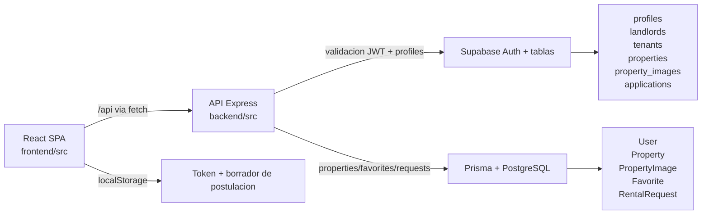

# Diagrama de arquitectura

```mermaid
flowchart LR
  Browser["React SPA<br/>frontend/src"] -->|/api via fetch| API["API Express<br/>backend/src"]
  Browser -->|localStorage| Local["Token + borrador de postulacion"]

  API -->|validacion JWT + profiles| SB["Supabase Auth + tablas"]
  API -->|properties/favorites/requests| Prisma["Prisma + PostgreSQL"]

  SB --> SBFlow["profiles<br/>landlords<br/>tenants<br/>properties<br/>property_images<br/>applications"]
  Prisma --> PrismaFlow["User<br/>Property<br/>PropertyImage<br/>Favorite<br/>RentalRequest"]
```

Notas:

- El runtime es hibrido, no de fuente unica.
- El flujo guiado de postulacion atraviesa los tres almacenes:
  - Supabase
  - Prisma
  - localStorage
