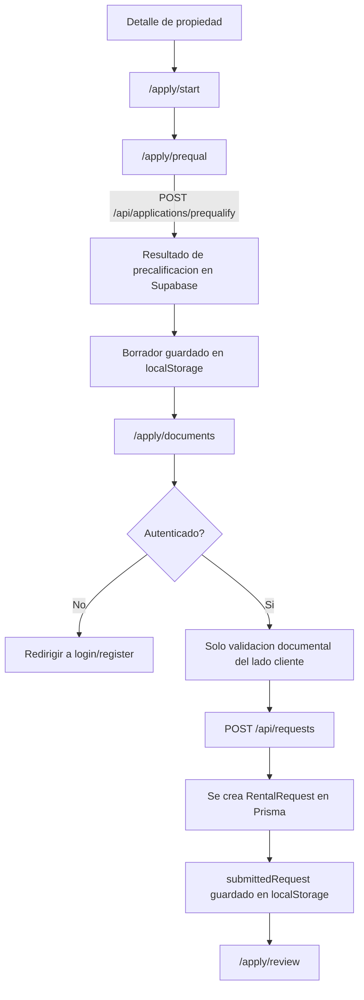
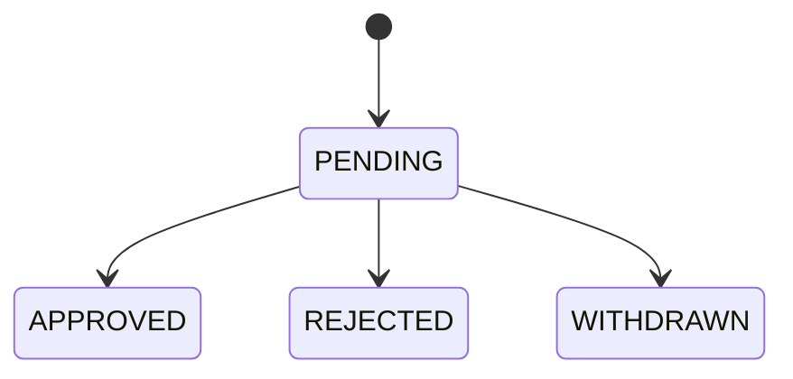

# Diagrama de flujo principal

## De postulacion guiada a solicitud de arriendo

## Estados de revision de solicitud

Notas:

- En el MVP actual los archivos no se suben al almacenamiento del backend.
- La pantalla de revision se reconstruye con el borrador local y la respuesta de la solicitud enviada.
